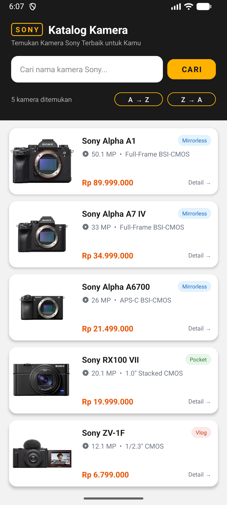
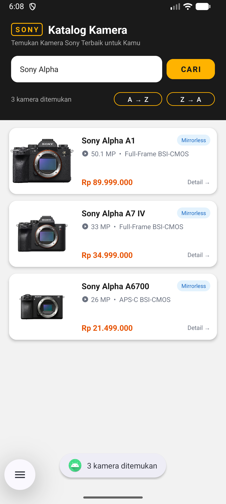
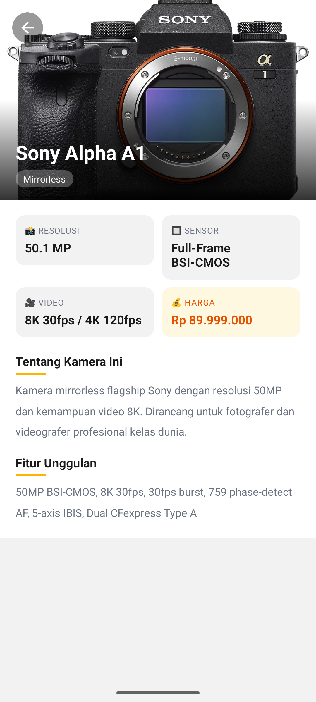
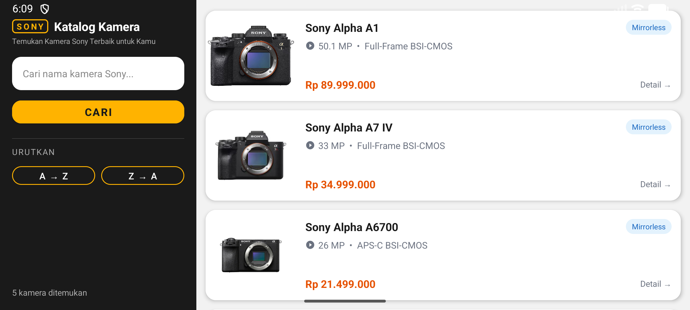
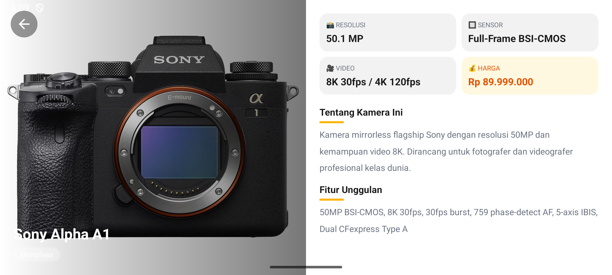
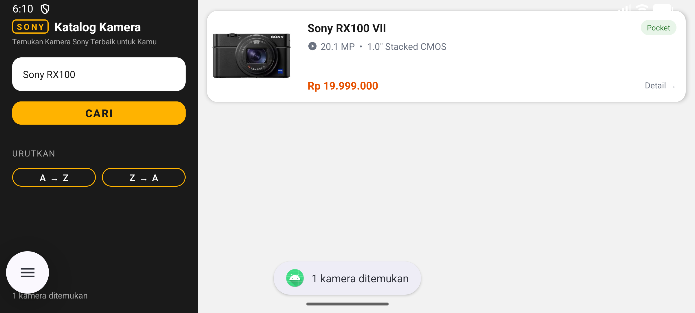
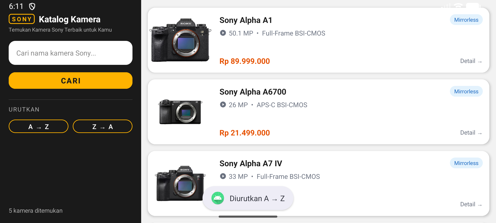
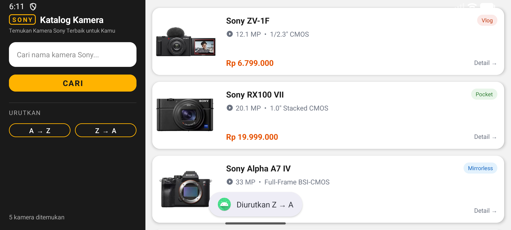
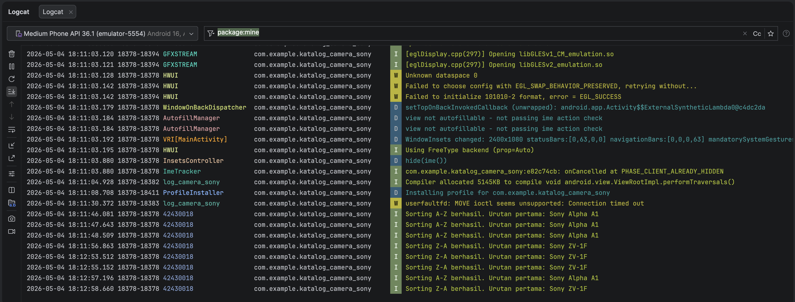

# Katalog Kamera Sony

Aplikasi Android Katalog & Pencarian Data berbasis Kotlin sebagai proyek UAS Pemrograman Seluler.

---

## Identitas Mahasiswa

| | |
|---|---|
| **Nama Lengkap** | I Nyoman Theo Ardiles Rada |
| **NIM** | 42430018 |
| **Topik Aplikasi** | Katalog Kamera Sony |

---

## Deskripsi Aplikasi

Aplikasi ini menampilkan katalog kamera-kamera Sony lengkap dengan spesifikasi teknisnya. Pengguna dapat mencari kamera berdasarkan nama menggunakan algoritma **Linear Search**, mengurutkan daftar kamera dari **A→Z atau Z→A** menggunakan algoritma **Bubble Sort**, serta melihat detail lengkap setiap kamera.

### Fitur Utama
- Daftar 5 kamera Sony (Mirrorless, Pocket, Vlog) dengan foto dan spesifikasi
- Pencarian kamera berdasarkan nama (Linear Search)
- Pengurutan A→Z dan Z→A (Bubble Sort)
- Counter jumlah kamera yang ditampilkan
- Empty state saat hasil pencarian kosong
- Halaman detail kamera dengan info lengkap (resolusi, sensor, video, harga, deskripsi, fitur)
- Penanganan error dengan try-catch di seluruh logika utama
- Logging aktivitas dengan Logcat (Tag: 42430018)

---

## Modul yang Diimplementasikan

| Modul | Fitur |
|---|---|
| Modul 2 & 3 | Desain UI rapi, layout responsif portrait & landscape |
| Modul 4 & 5 | Navigasi antar halaman (Intent) + validasi input kosong |
| Modul 6 | Struktur data Array + fitur Pencarian (Linear Search) |
| Modul 7 | Pengurutan A→Z dan Z→A (Bubble Sort) |
| Modul 9 | Penanganan error (try-catch) + Logcat dengan NIM sebagai Tag |

---

## Screenshot Aplikasi

### Tampilan Portrait







### Tampilan Landscape





---

## Screenshot Fitur Pencarian & Pengurutan

### Hasil Pencarian



### Pengurutan A → Z



### Pengurutan Z → A



---

## Screenshot Logcat




---

## Cara Menjalankan Aplikasi

1. Clone repository ini
2. Buka dengan Android Studio
3. Jalankan di emulator atau perangkat fisik (min. Android 7.0 / API 24)
4. Untuk melihat Logcat: buka tab **Logcat** di Android Studio, filter dengan tag `42430018`

---

## Struktur Project

```
app/src/main/java/com/example/katalog_camera_sony/
├── MainActivity.kt       — Daftar kamera, search, sort
├── DetailActivity.kt     — Halaman detail kamera
├── Kamera.kt             — Data class model kamera
└── KameraAdapter.kt      — RecyclerView adapter
```
